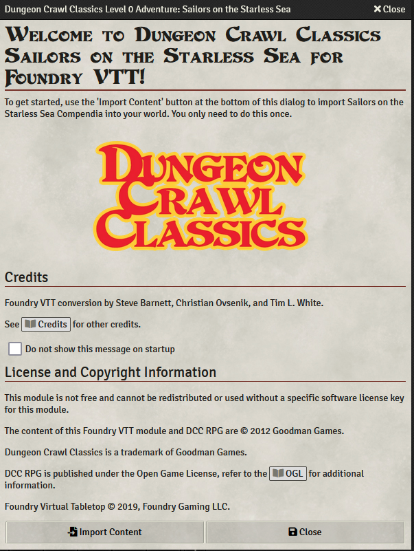
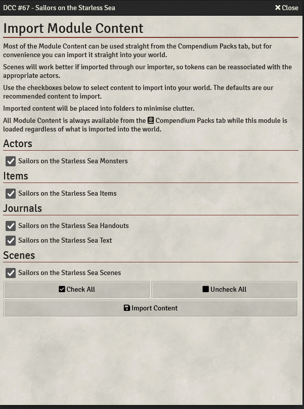
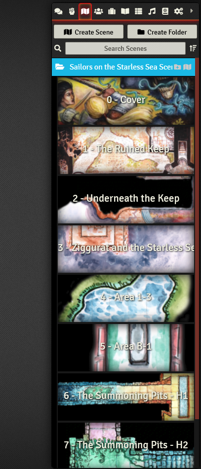
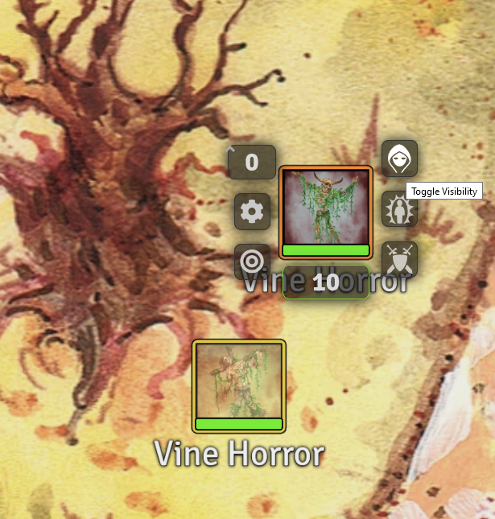

# Using a Published Adventure Module

Purchasing a module from Goodman Games gives you a prepared adventure with all the tokens, maps, and journal entries you need to run your game. There are only a few steps to getting started!

When you first load in, enable the module as normal. After the page refreshes, you will be prompted:

Choose **Import Content** to import the content from the compendiums that come with the module. Choose **Close** if you have already imported the content, or you don't want to. You can choose **Do not show this message** at startup to prevent the popup from presenting again.

## Importing Content

When you choose **Import Content**, you will be presented with a checklist of what you can import. Choose what you want to import and select **Import Content**.

This will present you with some progress messages on screen, then your content will be in your world instead of compendiums.

## Where are my Scenes?

After import, Scenes are not navigable by default. Right click a Scene and select **Toggle Navigation** to make it appear in the top of your screen for navigation.

## Where are the Notes on the map?

Make sure you click the **Journal Notes** button on the left, and select the magnifying glass. It should turn purple - this means your journal notes will show up on the map from the adventure text. These link to Journal entries. To allow players to see these, you may need to set the proper permissions on the journal entries after import.

## Revealing Monsters

By default, the monsters on the map are hidden. To reveal them, right click a token and select the hooded man icon.

